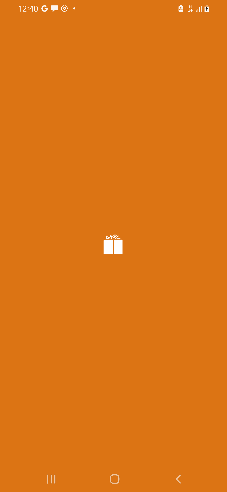

# Introduction
This is the solution to the grupp assessment test. A "Product Explorer" app featuring a list screen and a detail screen. Inspiration for the app's design is gotten from this [Figma design](https://www.figma.com/design/f6qH0NbOz4yYMgcufCpCap/Clothing-Store-App%2FFashion-E-Commerce-App-%7C-App%C2%A0UI%C2%A0Kit-(Community)?node-id=0-1&node-type=canvas&t=1i1AbOvvnt16GiZG-0). It follows the MVVM multi-module architecture using 3 layers/modules (data, domain and ui).
## Responsiveness
Constraint Layout is used in designing both screens. As it provides an easy way to design components without specifying their actual size thereby adapting to the screen dimension of the device running the app. 
# Screenshots
| ListScreen | DetailScreen |
|:----------:|:----------:
 | 

| SplashScreen |  |
|:--------------:|:-------:
 | 

# Libraries Used
- Gson
- Room
- Material design components
- Retrofit and OkHttp
- Robolectric
- Hilt
- Androidx Navigation
- Glide

# Running the App
1. Get the APK using any of the following method
    - Build from source
        - Clone this repository
        - Run "./gradlew :app:assembleRelease" to generate a release apk (the release is signed using the debug signing key for the sake of this assessment)
        - The generated apk will be availabe in the app/build/outputs/apk/release directory, where it can now be installed
    - Download directly from this repository
2. Launch the app
3. Wait for the list of products to be fetched
4. Select an item to view it's detail
5. Subsequent opening of the app will have the list of products already available for viewing

# Trade-offs
Things done differently if given more time, 
- Find a way to inform the user that the data being viewed is an outdated if internet is not available
- A dark theme
